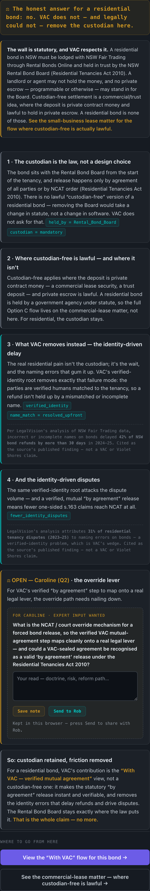

# S117 — D-TRIBUNAL-CFREE-PANEL-DEADEND fix

**Matter:** `tribunal-demo.html` · bond matter (MATTER-BOND-2026-1903) → Custodian-free tab
**Status:** BUILT · LIVE-verified · FOR ROB REVIEW before shipped
**Commit:** see git log (`[athena-exec] fix(tribunal): D-TRIBUNAL-CFREE-PANEL-DEADEND ...`)

## The defect

The bond matter's **Custodian-free** tab renders a *static honesty-wall* panel
(`panelMode`, `tribunal-demo.html` ~line 924). The wall is intentional and must stay
static: its whole point is the honest answer that **VAC will not — and legally could
not — remove the custodian for a residential bond** (the bond is held by the NSW Rental
Bond Board under the Residential Tenancies Act 2010). Because it is a panel and not a
stepper, the `.controls` bar (the Begin/advance button) is hidden.

The problem: a reader who opened that tab hit a **dead end**. The two forward pointers
already existed in the prose —

- "See the small-business lease matter for the flow where custodian-free is actually lawful" (~line 506)
- the "With VAC — verified mutual agreement" view callout (~line 512)

— but both were plain `.hil` highlighted **text, not clickable**. No forward affordance,
no obvious way to a tab that progresses.

## The fix (pure presentation / navigation)

Added a forward-affordance block **beneath the wall**, rendered only in `panelMode`
(`tribunal-demo.html` ~line 927). It contains two buttons:

1. **PRIMARY** — `View the "With VAC" flow for this bond →` → switches this matter to its
   verified `vac` view (`stageView='vac'`).
2. **SECONDARY** — `See the commercial-lease matter — where custodian-free is lawful →`
   → navigates to matter 05 (`selectMatter('lease')`) and lands on its custodian-free
   view, the one place on the page where custodian-free is lawful.

A small mono eyebrow label — "Where to go from here" — separates it from the wall.

**Explicitly NOT done:** no fake custodian-free stepper/flow for the residential bond.
That would undermine the honest wall. The wall content is untouched; only navigation
out of it was added. The buttons are guarded (primary only if the matter has a `vac`
view, secondary only if a distinct `lease` matter exists), so the block is safe if reused.

### Styling

Reuses the existing `.btn` / `.btn-primary` / `.btn-ghost` system and the dark
Athena/VAC palette. New CSS (`.wall-nav`, `.wall-nav-label`, `.wall-nav-btns`) is a
top-bordered block matching the wall cards. No emoji — consistent with the brand rule
and the existing scales-glyph (`⚖`) wall-banner; the buttons use a `→` arrow only.

## Matter 05 (commercial-lease) — checked, no fix needed

The task asked to confirm matter 05's custodian-free view does not have the same
no-exit. It does **not**: that view uses `cfSteps` (a concept stepper), so the
`.controls` bar with the advance button renders normally. Live-verified after clicking
the secondary button: `matter=MATTER-LEASE-2026-1147 view=cfree hasStepper=true
controlsVisible=true`. It progresses — no dead end. Left unchanged.

## Before / after

**Before:** Custodian-free tab on the bond matter ended at the wall's final card
("So: custodian retained, friction removed"). The forward pointers were non-clickable
`.hil` text. No button, no way forward — a dead end.

**After:** the same wall, now followed by a "Where to go from here" block with two
working buttons. Live verification on https://vacprotocol.org/tribunal-demo.html:

- Primary click → `view=vac matter=MATTER-BOND-2026-1903` ✓
- Secondary click → `matter=MATTER-LEASE-2026-1147 view=cfree` (stepper + controls present) ✓

Screenshot (after): `docs/strategic/assets/S117-cfree-deadend-after.png`

## Console note

The headless browse console shows MediaPipe `WebGL 2 failed → Fall back on WebGL 1`
warnings and a `HandLandmarker unavailable, will use timer fallback` message. These are
pre-existing GPU-absent-in-headless artifacts of the finger-gesture modality, unrelated
to this change.
