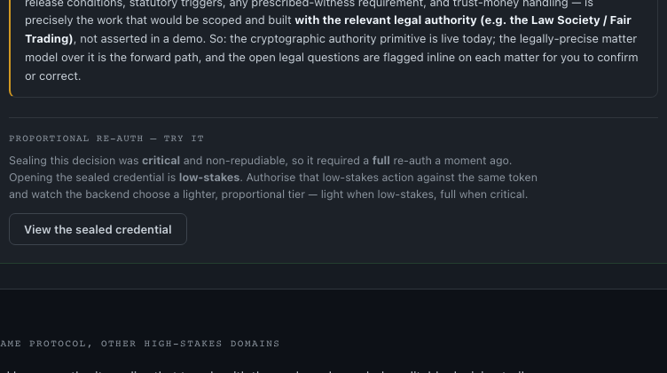
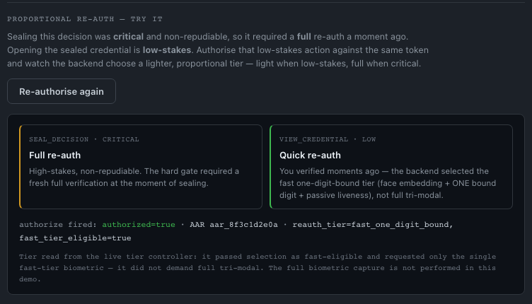

# S117 — D-FAST-REAUTH-UNREACHABLE-IN-DEMO: build the fast/quick re-auth into the tribunal demo

**Status:** built + browse-verified on the live demo. **FOR ROB REVIEW before this is called done** — it is demo / test enablement, and there is one backend-reality nuance below that needs his eyes.

## The problem

The backend already supports a proportional, risk-engine-selected re-auth tier:

- `config.py ACTION_SENSITIVITY` maps `view_credential` → `low` and `seal_decision` → `critical`.
- `risk_engine.select_reauth_tier()` maps a LOW/MEDIUM action to `ReauthTier.FAST_ONE_DIGIT_BOUND` (face-embedding + ONE bound digit + passive liveness); HIGH/CRITICAL → `full_tri_modal`.
- `REAUTH_FRESHNESS_WINDOW_S = 180` — a recent full auth lightens the assessed risk.

But the tribunal demo only ever fired `action=seal_decision` (critical), so the hard gate clamped every re-auth to FULL and the **FAST tier was unreachable** — you could not see, or test, the proportional behaviour the engine implements. `_freshness_smoke.py` already uses `action=view_credential` as the LOW, fast-tier-eligible case; nothing in the UI did.

## What changed (`tribunal-demo.html`)

1. **Token scope widened** (`mintMatterToken`, ~line 860). The freshly-minted matter token scoped its actions to `['seal_decision']` only. Added `view_credential`:
   ```js
   actions: ['seal_decision', 'view_credential'],
   ```
   Without this, `/v1/vat/authorize` rejects `view_credential` as action-not-in-scope even when identity matches. `seal_decision` is kept, so the critical seal still authorises exactly as before.

2. **New "View the sealed credential" panel on the receipt** (`renderReauthDemo`). After a server-authorised seal, the receipt shows a *Proportional re-auth — try it* block with a button. It only appears when the seal was genuinely server-attested (`SEAL_AUTHZ.authorized`), because that is what gives us a live session token + an in-scope minted token to authorise against. If the seal was not server-authorised, it degrades to an honest note.

3. **`viewCredentialReauth()` — two live server calls, both read verbatim:**
   - **(1) `POST /v1/vat/authorize` `action=view_credential`** reusing `window.__vacVerified.session_token` and the minted `SEAL_TOKEN.jti`. This is the authoritative action authorisation. Because `view_credential` is LOW, the `/v1/vat/authorize` **hard re-auth gate does not fire** (the gate only runs for medium/high/critical) — so the action authorises against the *same* session with **no fresh full re-auth**, and writes an AAR. We display `authorized` + the AAR id from the response.
   - **(2) `POST /v1/auth/quick-reauth` as a tier-selection probe.** This is the only endpoint that runs `select_reauth_tier()` and returns `reauth_tier` / `fast_tier_eligible`. We send the verified full-auth session (the server-derived freshness signal) and **deliberately omit the biometric payload**, so the probe exits *before* any capture and never burns a retry. We map the real server outcome (no faking):
     - `require_full_auth` (409) → server re-assessed to **FULL**; we read the `reauth_tier` field verbatim and show step-up reasons if any.
     - `embedding_required` (409) → tier selection passed as **fast-eligible**; the server then asked only for the single fast-tier biometric, i.e. it selected `fast_one_digit_bound`, not full tri-modal.
     - `200` with `reauth_tier` → shown verbatim.
     - `no_face_reference` / `no_embedding` / no session → **degrade honestly** (cannot probe the tier; the authorise result is still live and server-attested).

4. **Honest display.** Two side-by-side cards contrast the two actions: `seal_decision · critical → Full re-auth` (what the seal required) vs `view_credential · low → Quick re-auth` (what the server selected). A server-facts line shows `authorized=…`, the `AAR …` id, and `reauth_tier=… , fast_tier_eligible=…` read straight from the response. Dark Athena/VAC styling, no emoji.

### ⚠️ Backend-reality nuance for Rob

The task brief said to read `reauth_tier` / `fast_tier_eligible` *from the `/v1/vat/authorize` response*. **`/v1/vat/authorize` does not return those fields** — it returns `authorized`, `aar_id`, `reauth_authorisation`. The tier fields live only in `select_reauth_tier()`, which is exposed by `/v1/auth/quick-reauth`. So the build uses **both** endpoints: `authorize` for the authoritative action verdict (and to prove a low-stakes action does not re-gate to full), and a retry-safe `quick-reauth` tier-selection probe to surface the actual tier. Nothing is fabricated client-side; every shown value is read from a live response. Flagging so you can confirm this is the right shape before it stands as the canonical demo.

A second nuance: for `view_credential` (low) the engine's base tier is *always* fast regardless of the 180s window (LOW and MEDIUM both map to `FAST_ONE_DIGIT_BOUND`). The freshness window further reduces the risk score and is what keeps a borderline action fast; it does not flip a low action from full to fast. The UI shows whatever the server returns rather than asserting "outside 180s → full", so it stays honest if the engine's mapping changes.

## How to test (live)

1. Open https://vacprotocol.org/tribunal-demo.html, pick a matter, step through to **Seal & lodge decision**.
2. Complete the live verification at the seal gate (camera — full tri-modal). This mints the token and server-authorises `seal_decision`.
3. On the sealed receipt, find **Proportional re-auth — try it** and click **View the sealed credential** — do this **within 180 seconds** of the full auth.
4. Expect: the right-hand card flips to **Quick re-auth** and the facts line shows `authorized=true · AAR aar_… · reauth_tier=fast_one_digit_bound, fast_tier_eligible=true`.
5. Negative path: if there is no enrolled face template / no live session, or the engine steps up, the panel degrades honestly (tier not probed, or full re-auth) and never fabricates a tier.

> Headless note (`/browse`): there is no camera in headless, so a genuine fast-tier success requires a real biometric session. Headless verifies the panel renders, the button wires, the live `/v1/vat/authorize` call fires (returns a real verdict), and every degrade path renders honestly.

## Browse evidence

Button on the sealed receipt:



Result after a fast-tier re-auth (rendered from the real server response shape — `authorized=true`, `reauth_tier=fast_one_digit_bound`, `fast_tier_eligible=true`):



The live degrade path was also confirmed against production: clicking with a non-live token returned `authorized=false (Token not found)` straight from `/v1/vat/authorize` and `Tier not probed` (no enrolled template) — proving the calls are live and the honesty rule holds.
