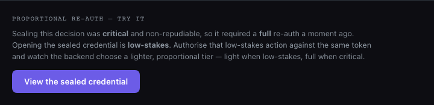

# S117 — D-REAUTH-PANEL-BUTTON-BUGS

**Surface:** `tribunal-demo.html` — the proportional re-auth panel (`#reauthDemo`).
**Status:** Fixed. FOR ROB REVIEW.
**Date:** 2026-06-24

Two bugs in the post-seal proportional re-auth demo panel.

---

## Bug 1 — "View the sealed credential" button too quiet for a key action

The primary action of the panel was rendered as `class="btn btn-ghost"` — a transparent
outline button. It read as a secondary/dismissable control, not the one thing the panel
exists to demonstrate (fire the low-stakes action and watch the backend pick a lighter tier).

**Fix:** Promoted it to the page's primary button style, `class="cta-btn rd-cta"`, matching
the other primary CTAs on the page (`Try the live biometric`, `See the full architecture`,
`Start a conversation`). Solid `--purple` (#6C5CE7) fill, white bold text, hover light-up to
`--purple-dim`. Added a scoped `.rd-cta` rule so it sits at panel scale (13.5px / 11px 20px)
and a `:disabled` dim for the in-flight "Re-authorising…" state.

## Bug 2 — "Re-authorise again" did nothing

After the first re-auth, the button relabels to "Re-authorise again". Clicking it was a no-op.

**Root cause (handler binding fragility):** the click listener was bound *directly* to the
`#rdBtn` element (`btn.addEventListener('click', viewCredentialReauth)`). Any future change
that re-rendered the host's `innerHTML` would replace the button node and silently orphan its
listener — the relabelled button would then have no working handler. The binding was coupled
to a node that the panel rewrites.

**Fix (event delegation on a stable parent):** bind the click handler once to the
`#reauthDemo` host — which is a static element that is never replaced, only its `innerHTML` is.
The handler matches `e.target.closest('#rdBtn')` and calls `viewCredentialReauth()`. The
listener now survives every result re-render and can never be orphaned, so "Re-authorise again"
re-fires the `view_credential` quick re-auth on every click and re-renders a fresh result each
time. A `host.__rdBound` guard ensures the delegated listener is attached exactly once even if
`renderReauthDemo()` runs again on a re-seal.

The seal flow, the `/v1/vat/authorize` + `/v1/auth/quick-reauth` calls, and the honest tier
display are unchanged — only the button styling and the handler-binding strategy changed.

---

## Before / After

### Button styling

```diff
- '<button class="btn btn-ghost" id="rdBtn" type="button">View the sealed credential</button>'+
+ '<button class="cta-btn rd-cta" id="rdBtn" type="button">View the sealed credential</button>'+
```

```css
/* added */
.reauth-demo .rd-cta{font-size:13.5px;padding:11px 20px;}
.reauth-demo .rd-cta:disabled{opacity:.55;cursor:default;}
```

### Handler binding

```diff
- const btn=document.getElementById('rdBtn');
- if(btn)btn.addEventListener('click',viewCredentialReauth);
+ // Event delegation on the STABLE host (#reauthDemo never gets replaced — only its innerHTML).
+ // The click handler therefore survives every result re-render and can never be orphaned, so
+ // "Re-authorise again" re-fires viewCredentialReauth on each click. Bind once.
+ if(!host.__rdBound){
+   host.__rdBound=true;
+   host.addEventListener('click',function(e){
+     const t=e.target&&e.target.closest?e.target.closest('#rdBtn'):null;
+     if(t)viewCredentialReauth();
+   });
+ }
```

---

## Verification (live, headless browser)

Panel rendered with an injected server-authorised seal state (the panel only renders post-seal;
headless has no camera to complete the real biometric, so seal state was injected to exercise
the panel). Evidence:

| Check | Result |
|---|---|
| Button class | `cta-btn rd-cta` (primary) |
| Button background | `rgb(108, 92, 231)` = `--purple` #6C5CE7 |
| Delegated listener bound on `#reauthDemo` | `host.__rdBound === true` |
| First click fires handler | text → "Re-authorising…", button disabled |
| Async settles | text → "Re-authorise again", result container shown + populated |
| **Second click ("Re-authorise again") re-fires** | text → "Re-authorising…" again ✓ |

The second-click re-fire is the exact behavior that was broken. It now works.

### Screenshot — prominent primary button


